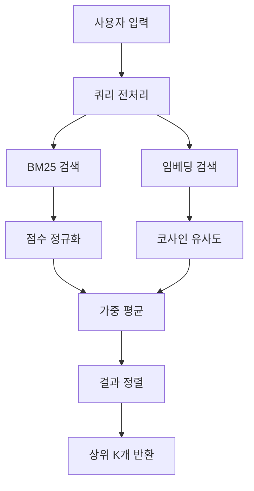

## 📋 목차

1. 프로젝트 개요
2. 시스템 아키텍처
3. 핵심 컴포넌트 분석
4. 데이터 구조 및 흐름
5. Hybrid Search 알고리즘
6. 파서 시스템
7. 사용자 인터페이스
8. 성능 최적화
9. 설정 및 환경
10. 확장성 및 개선사항

---

## 프로젝트 개요

### 🎯 목적

결과코드 RAG(Retrieval-Augmented Generation) 시스템은 SMS, 알림톡, RCS 등의 메시징 서비스에서 발생하는 다양한 결과코드를 효율적으로 검색하고 설명을 제공하는 시스템입니다.

### 🔑 핵심 특징

- **Hybrid Search**: 임베딩 벡터 + BM25 알고리즘 조합
- **다국어 지원**: 한국어, 영어, 숫자 혼합 텍스트 처리
- **실시간 검색**: Streamlit 기반 웹 인터페이스
- **자동 데이터 추출**: PDF 및 엑셀 데이터 자동 파싱
- **신뢰도 기반**: 검색 결과의 신뢰도 점수 제공

---

## 시스템 아키텍처

### 🏗️ 전체 구조도

```
Streamlit Web UI
 ├─ 검색 탭
 ├─ 데이터 관리
 └─ 파일 업로드
      │
RAG System Core
 ├─ Hybrid Search Engine
 │   ├─ BM25
 │   ├─ Embedding
 │   └─ Fusion Algorithm
      │
Data Processing Layer
 ├─ PDF Parser
 ├─ Excel Parser
 └─ Data Store (JSON)

```

### 🔄 데이터 흐름

1. **사용자 입력** → Streamlit UI
2. **쿼리 전처리** → RAG System
3. **Hybrid Search** → BM25 + 임베딩 검색
4. **결과 통합** → 가중 평균 점수 계산
5. **결과 반환** → 신뢰도 기반 정렬된 결과

---

## 핵심 컴포넌트 분석

### 1. RAG System (`rag_system.py`)

### 🎯 역할

- 전체 시스템의 핵심 오케스트레이터
- 사용자 쿼리 처리 및 결과 반환
- 데이터 관리 및 CRUD 작업

### 🔧 주요 메서드

```python
class RAGSystem:
    def __init__(self):
        self.hybrid_search = HybridSearch()
        self.pdf_parser = PDFParser()
        self.excel_parser = ExcelParser()

    def process_query(self, query: str) -> Dict:
        processed_query = self._preprocess_query(query)
        result = self.hybrid_search.find_code_description(processed_query)
        return result

    def process_query_with_duplicates(self, query: str) -> Dict:
        processed_query = self._preprocess_query(query)
        code_match = re.search(r'(\d+)', processed_query)
        if not code_match:
            return {'code': query, 'descriptions': [], 'confidence': 0.0, 'message': '코드를 찾을 수 없습니다.'}

        target_code = code_match.group(1)
        matching_codes = []
        for item in self.hybrid_search.data:
            if item['code'] == target_code:
                matching_codes.append({
                    'description': item['description'],
                    'category': item.get('category', '기타')
                })

        return {
            'code': target_code,
            'descriptions': matching_codes,
            'confidence': 1.0,
            'count': len(matching_codes)
        }

```

### 🔍 쿼리 전처리

```python
def _preprocess_query(self, query: str) -> str:
    query = query.strip()
    if not query.startswith("결과코드"):
        if re.search(r'\d+', query):
            query = f"결과코드 {query}"
    return query

```

---

### 2. Hybrid Search (`hybrid_search.py`)

### 🎯 역할

- BM25와 임베딩 검색의 하이브리드 구현
- 다국어 텍스트 처리
- 실시간 가중치 조정 지원

### 🔧 핵심 알고리즘

```python
class HybridSearch:
    def __init__(self, data_file: str = None):
        self.data_file = data_file or config.DATA_FILE
        self.data = self._load_data()
        self.embedding_model = SentenceTransformer(config.EMBEDDING_MODEL)
        self.bm25 = self._build_bm25()
        self.embeddings = self._build_embeddings()

    def search(self, query: str, top_k: int = None) -> List[Dict]:
        if not self.data:
            return []
        top_k = top_k or config.TOP_K_RESULTS
        processed_query = self._preprocess_query(query)
        bm25_scores = self._get_bm25_scores(processed_query)
        embedding_scores = self._get_embedding_scores(processed_query)
        hybrid_scores = self._calculate_hybrid_scores(bm25_scores, embedding_scores)

        results = []
        for i, score in enumerate(hybrid_scores):
            if i < len(self.data):
                results.append({
                    'code': self.data[i]['code'],
                    'description': self.data[i]['description'],
                    'category': self.data[i]['category'],
                    'score': float(score),
                    'bm25_score': float(bm25_scores[i]),
                    'embedding_score': float(embedding_scores[i])
                })
        results.sort(key=lambda x: x['score'], reverse=True)
        return results[:top_k]

```

### 🌐 다국어 토큰화

```python
def _tokenize(self, text: str) -> List[str]:
    import re
    tokens = re.findall(r'[가-힣]+|[a-zA-Z]+|\d+|[^\s]', text)
    return [token.lower() for token in tokens if token.strip()]

```

### 📊 점수 계산

```python
def _calculate_hybrid_scores(self, bm25_scores: np.ndarray, embedding_scores: np.ndarray) -> np.ndarray:
    if len(bm25_scores) == 0:
        return embedding_scores
    if len(embedding_scores) == 0:
        return bm25_scores
    return (config.BM25_WEIGHT * bm25_scores + config.EMBEDDING_WEIGHT * embedding_scores)

```

---

### 3. PDF Parser (`pdf_parser.py`)

- PDF에서 결과코드 추출
- `pdfplumber`, `PyMuPDF`, `PyPDF2` 지원
- 신뢰도 기반 필터링

```python
class PDFParser:
    def __init__(self):
        self.code_patterns = [r'(\d+)\s*[:：]?\s*(.+)']

    def _extract_codes_from_text(self, text: str, page_num: int) -> List[ExtractedCode]:
        codes = []
        lines = text.split('\n')
        for line in lines:
            line = line.strip()
            if not line: continue
            parts = line.split("\t")
            for part in parts:
                part = part.strip()
                if not part: continue
                for pattern in self.code_patterns:
                    match = re.match(pattern, part)
                    if match:
                        code, description = match.groups()
                        confidence = self._calculate_confidence(code, description, part)
                        codes.append(ExtractedCode(
                            code=code,
                            description=description.strip(),
                            page_number=page_num,
                            confidence=confidence
                        ))
        return codes

```

### 신뢰도 계산

```python
def _calculate_confidence(self, code: str, description: str, line: str) -> float:
    confidence = 0.5
    if code.isdigit(): confidence += 0.2
    if len(description) > 5: confidence += 0.2
    if re.search(r'[가-힣]', description): confidence += 0.1
    keywords = ['오류', '에러', '실패', '장애', '인증', '권한', '네트워크', '시스템']
    if any(k in description for k in keywords): confidence += 0.1
    return min(confidence, 1.0)

```

---

### 4. Excel Parser (`excel_parser.py`)

- 컬럼 매핑, 데이터 검증, 정리

```python
def _map_columns(self, df: pd.DataFrame) -> pd.DataFrame:
    column_mapping = {}
    for col in df.columns:
        col_lower = col.lower().strip()
        if any(k in col_lower for k in ['코드','code','번호','id']): column_mapping[col]='code'
        elif any(k in col_lower for k in ['설명','description','내용','메모','comment']): column_mapping[col]='description'
        elif any(k in col_lower for k in ['카테고리','category','분류','type']): column_mapping[col]='category'
    df = df.rename(columns=column_mapping)
    if 'code' not in df.columns and len(df.columns)>=1: df = df.rename(columns={df.columns[0]:'code'})
    if 'description' not in df.columns and len(df.columns)>=2: df = df.rename(columns={df.columns[1]:'description'})
    return df

```

---

## 데이터 구조 및 흐름

### 결과코드 객체

```json
{
  "code": "4007",
  "description": "서비스 요청한 클라이언트가 permission이 없는 경우...",
  "category": "일반"
}

```

### 검색 결과 객체

```json
{
  "code": "4007",
  "description": "서비스 요청한 클라이언트가 permission이 없는 경우...",
  "category": "일반",
  "score": 0.88,
  "bm25_score": 0.75,
  "embedding_score": 0.92
}

```

### 데이터 처리 파이프라인 (mermaid)



### JSON 저장 예시

```json
[
  {"code": "-2", "description": "전달 대기중", "category": "일반"},
  {"code": "0", "description": "전송 성공", "category": "일반"}
]

```

---

